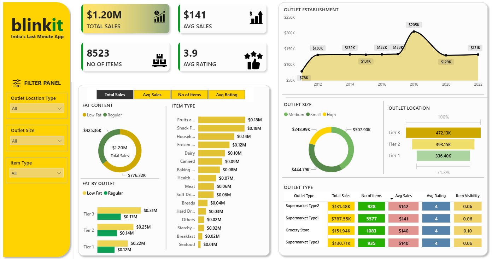

# 🛒 Blinkit Sales Analysis Dashboard | Power BI

An interactive **Blinkit Sales Analysis Dashboard** built using **Microsoft Power BI** to analyze sales performance, outlet characteristics, product categories, customer ratings, and item distribution.

The project uses **Power Query** for data cleaning and transformation and Power BI for data visualization and interactive analysis.

---

## 📊 Dashboard Preview



---

## 🎯 Project Objective

The objective of this project is to analyze Blinkit's sales data and build an interactive dashboard that helps understand:

- Overall sales performance
- Average sales and customer ratings
- Product-wise sales performance
- Outlet performance
- Outlet location and size analysis
- Fat content distribution
- Item category performance
- Outlet establishment trends
- Item visibility and ratings

---

## 📌 Key KPIs

| KPI | Value |
|---|---:|
| Total Sales | $1.20M |
| Average Sales | $141 |
| Number of Items | 8,523 |
| Average Rating | 3.9 |

---

## 📈 Dashboard Analysis

### 1. Outlet Establishment

The dashboard shows sales trends based on the outlet establishment year.

The highest sales in the dataset are observed around **2018**, with approximately **$205K** in sales.

---

### 2. Fat Content Analysis

Sales are analyzed based on the fat content of products:

- Low Fat
- Regular

The dashboard allows comparison of total sales and outlet-level performance across different fat-content categories.

---

### 3. Item Type Analysis

The dashboard compares sales across different product categories, including:

- Fruits & Vegetables
- Snack Foods
- Household
- Frozen Foods
- Dairy
- Canned
- Baking Goods
- Health & Hygiene
- Meat
- Soft Drinks
- Breads
- Hard Drinks
- Starchy Foods
- Breakfast
- Seafood
- Others

**Fruits & Vegetables** and **Snack Foods** are among the top-performing categories.

---

### 4. Outlet Size Analysis

Outlets are categorized into:

- Small
- Medium
- High

The dashboard compares sales performance across different outlet sizes.

---

### 5. Outlet Location Analysis

Sales are analyzed across different outlet location tiers:

- Tier 1
- Tier 2
- Tier 3

**Tier 3 outlets generate the highest sales** among the three location tiers in the dashboard.

---

### 6. Outlet Type Analysis

The dashboard compares different outlet types using:

- Total Sales
- Number of Items
- Average Sales
- Average Rating
- Item Visibility

The analysis helps identify which outlet formats contribute the most to overall sales.

---

## 🔍 Key Insights

Some important observations from the dashboard include:

- Total sales are approximately **$1.20M**.
- The average sales per item is approximately **$141**.
- The dataset contains **8,523 items**.
- The average customer rating is approximately **3.9**.
- **Fruits & Vegetables** and **Snack Foods** are among the highest-selling item categories.
- **Tier 3 outlets** generate the highest sales among the three outlet location tiers.
- **Supermarket Type1** is the strongest-performing outlet type by total sales.
- Sales performance varies significantly based on outlet size, location, and item characteristics.
- The dashboard provides an interactive way to identify sales patterns across different product and outlet dimensions.

---

## 🛠️ Tools & Technologies

### Microsoft Power BI

- Data Visualization
- Interactive Dashboard Design
- KPI Cards
- Charts
- Slicers
- Tables
- Donut Charts
- Bar Charts
- Line/Area Charts

### Power Query

- Data Cleaning
- Data Transformation
- Data Type Handling
- Data Preparation
- Column Transformation
- Data Validation

---

## 🎛️ Interactive Features

The dashboard includes interactive filters for:

- Outlet Location Type
- Outlet Size
- Item Type

Users can apply these filters to dynamically analyze sales performance across different segments.

---

## 📊 Dashboard Components

The dashboard contains:

- KPI Cards
- Outlet Establishment Trend
- Fat Content Analysis
- Item Type Sales Analysis
- Fat Content by Outlet
- Outlet Size Analysis
- Outlet Location Analysis
- Outlet Type Performance Table
- Interactive Filter Panel

---

## 💡 Business Questions Answered

This dashboard helps answer questions such as:

1. What is the total sales generated?
2. What is the average sales per item?
3. Which item categories generate the highest sales?
4. Which outlet location tier performs the best?
5. Which outlet size generates the most sales?
6. How do Low Fat and Regular products compare?
7. Which outlet type has the highest sales?
8. How have sales changed based on outlet establishment year?
9. What is the average customer rating?
10. How does item visibility vary across outlet types?
11. Which product categories should receive more attention?
12. Which outlet segments are performing better?

---

## 🚀 Key Learning Outcomes

Through this project, I practiced:

- Importing and preparing data in Power BI
- Cleaning and transforming data using Power Query
- Creating meaningful KPIs
- Designing interactive dashboards
- Selecting appropriate visualizations
- Creating dynamic filters and slicers
- Analyzing sales performance
- Identifying business trends and patterns
- Presenting data-driven insights in a clear format

---

## 📂 Project Structure

```text
Blinkit-Sales-Analysis/
│
├── Blinkit_Sales_Dashboard.pbix
├── dashboard.png
└── README.md
